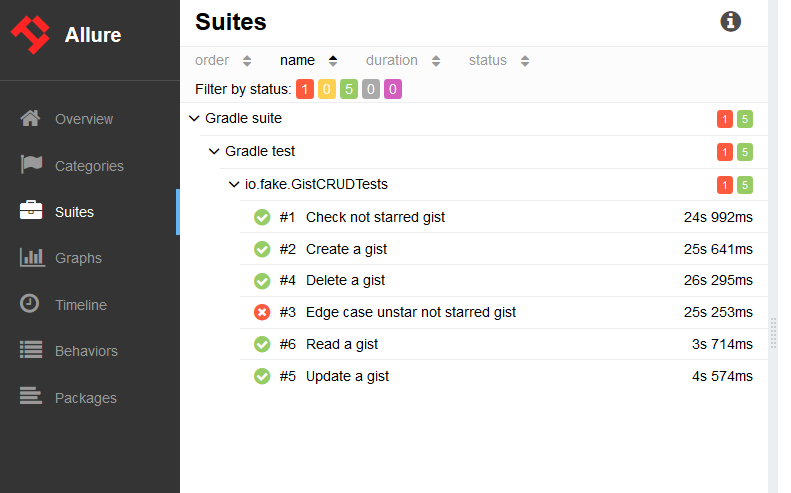
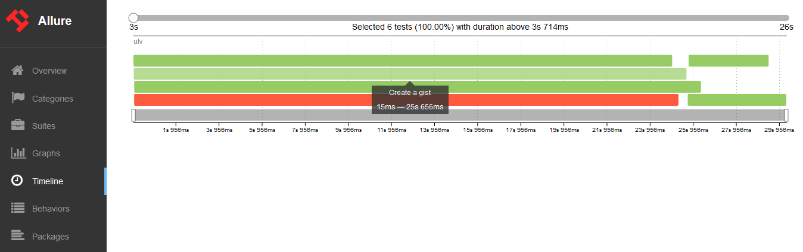

# GistTests

Github gists api tests

How to run: gradlew clean test -Dtoken="GITHUB_TOKEN" && gradlew allureReport

Project created in Kotlin, with gradle, rest assured, testNG, allure report and assertJ

After allureReport will be generated in ./build/reports/allure-report (better open in Firefox)
Suites has tests results

Timeline shows how it was run in parallel

